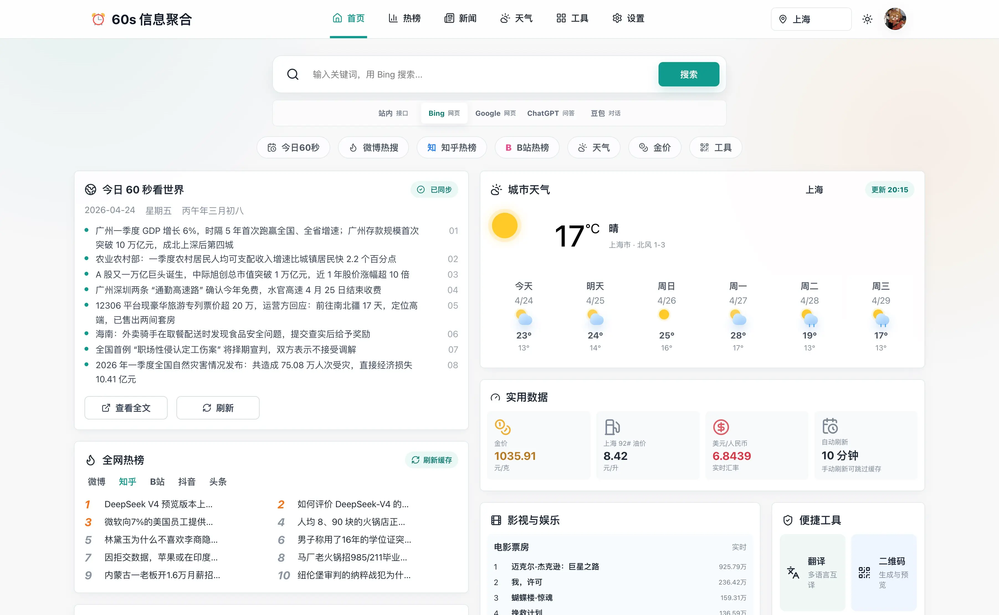

<p align="center">
  
</p>

<h1 align="center">60s-web</h1>

<p align="center">
  基于 <a href="https://github.com/vikiboss/60s">vikiboss/60s</a> API 构建的开源信息首页。每天 60 秒看世界，也看热榜、天气、实用数据和常用工具。
</p>

<p align="center">
  <a href="https://github.com/dogxii/60s-web"></a>
  
  
  
  
</p>

<p align="center">
  <a href="https://60s.dogxi.me/">在线体验</a> ·
  <a href="./docs/deploy.md">部署文档</a> ·
  <a href="https://github.com/vikiboss/60s">60s API</a> ·
  <a href="https://github.com/dogxii/60s-web/issues">反馈建议</a>
</p>



## ❓ 为什么用

- 一页聚合每日简报、全网热榜、天气、金价、油价、汇率和轻量工具。
- 纯前端应用，无数据库，无自建后端，API 地址由用户自行配置。
- 设置保存在浏览器本地，支持城市、主题、壁纸、头像、收藏和自定义 API 地址。
- 适合作为浏览器首页、PWA、个人服务器入口或家庭网络信息面板。

## 🚀 快速开始

```bash
bun install
bun run dev
```

默认访问：

```text
http://localhost:5173
```

生产构建：

```bash
bun run build
bun run preview
```

## 🔌 API 配置

- 默认不内置 API 地址，避免启动时消耗作者公共实例额度。
- 首次打开会显示配置引导，可查看 [公共实例列表](https://docs.60s-api.viki.moe/7306811m0)，也可前往 [vikiboss/60s](https://github.com/vikiboss/60s) 自行部署。
- 在应用内保存 API 地址后才会同步数据；输入过程不会触发请求，检测成功会自动保存。

## ⚡️ 部署

<p align="center">
  <a href="https://vercel.com/new/clone?repository-url=https%3A%2F%2Fgithub.com%2Fdogxii%2F60s-web&project-name=60s-web&repository-name=60s-web">
    
  </a>
  <a href="https://deploy.workers.cloudflare.com/?url=https://github.com/dogxii/60s-web">
    
  </a>
</p>

这是一个 Vite 静态前端项目。执行 `bun run build` 后发布 `dist/` 即可，也可以使用仓库内置的 `Dockerfile`、`vercel.json` 或 `wrangler.jsonc` 部署到你喜欢的平台。

完整部署说明见 [docs/deploy.md](./docs/deploy.md)，包含一键部署、Docker、Docker Compose、Nginx 和上线检查。

## 🙏 致谢

感谢 [vikiboss/60s](https://github.com/vikiboss/60s) 提供高质量、开源、可靠的开放 API。本项目专注于前端展示、个性化配置和日常浏览体验。

## 📈 项目 Star 历史

<a href="https://www.star-history.com/?repos=dogxii%2F60s-web&type=date&legend=bottom-right">
 <picture>
   <source media="(prefers-color-scheme: dark)" srcset="https://api.star-history.com/chart?repos=dogxii/60s-web&type=date&theme=dark&legend=bottom-right" />
   <source media="(prefers-color-scheme: light)" srcset="https://api.star-history.com/chart?repos=dogxii/60s-web&type=date&legend=bottom-right" />
   
 </picture>
</a>

## 🪪 License

MIT [@Dogxi](https://github.com/dogxii)
